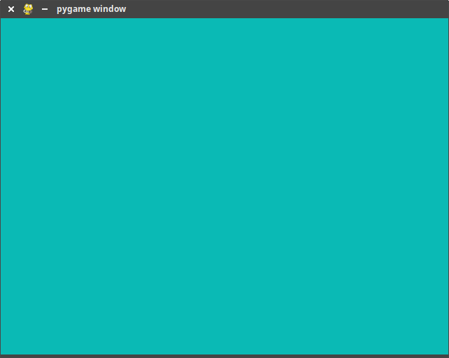
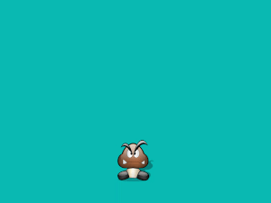

# Initiation à Pygame
{: .center width=40%}


## 0. Preambule
Pygame est un package de Python facilitant la création de jeux basés une interface graphique. Vous pouvez :

- l'installer sur votre distribution Python, par ```pip3 install pygame```.
- le tester directement via https://repl.it/, en choisissant ```pygame``` dans la liste des langages proposés.

## 1. Préparation de la scène du jeu

```python
import pygame, sys
from pygame.locals import *

pygame.init()

fenetre = pygame.display.set_mode((640, 480))

fenetre.fill([10,186,181])

pygame.display.flip()

while True :
  pass
``` 

Ce code devrait vous donner ceci :

{: .center}


**Commentaires**

- Le package ```sys``` permettra de fermer le programme au niveau de l'OS par la commande ```sys.exit()``` 
- La ligne ```from pygame.locals import *``` permettra d'utiliser des variables locales déjà définies par ```pygame```, comme ```MOUSEBUTTONDOWN```, par exemple.
- Durant tout le code, notre scène de travail sera l'objet ```fenetre```, dans lequel nous viendrons coller de nouveaux éléments. 

**Éléments structurants d'un code ```pygame``` :**

- ```pygame.init()```  effectue une initialisation globale de tous les modules ```pygame``` importés. À mettre au début du code.
- ```pygame.display.flip()``` effectue un rafraîchissement total de tous les éléments graphiques de la fenêtre. À mettre donc plutôt vers la fin du code.
- ```while True :``` comme très souvent dans les jeux, la structure essentielle est une boucle infinie dont on ne sortira que par une interruption système (```sys.exit()```) où lors de la bascule d'un booléen. Pour l'instant, cette boucle est vide (```pass``` ).


## 2. Apparition d'un personnage

### 2.1. Téléchargement de l'image
Nous allons travailler avec le sprite ci-dessous, nommé ```perso.png```. Il est issu de [https://openclassrooms.com/fr/courses/1399541-interface-graphique-pygame-pour-python/1399813-premieres-fenetres](https://openclassrooms.com/fr/courses/1399541-interface-graphique-pygame-pour-python/1399813-premieres-fenetres)


{: .center}


[Téléchargez-le](data/perso.png) pour le mettre dans le même dossier que votre code ```pygame```.

Vous pouvez trouver sur internet un grand nombre de sprites libres de droits, au format ```png``` (donc gérant la transparence), dans de multiples positions (ce qui permet de simuler des mouvements fluides). Ici nous travaillerons avec un sprite unique.

### 2.2. Importation de l'image dans la fenêtre

```python
perso = pygame.image.load("perso.png").convert_alpha()
```
La fonction ```convert_alpha()``` est appelée pour que soit correctement traité le canal de transparence (canal _alpha_) de notre image.

### 2.3. Affichage de l'image

À ce stade, ```perso``` est un objet ```pygame``` de type ```Surface``` .

Afin de facilement pouvoir le déplacer, nous allons stocker la position de cet objet dans une variable ```position_perso```,  qui sera de type ```rect```. 

```python
position_perso = perso.get_rect()
```
Pour afficher cette image, nous allons venir le superposer aux éléments graphiques déjà dessinés (en l'occurence : rien) avec l'instruction ```blit()``` :

```python
fenetre.blit(perso, position_perso)
```

**▸ récapitulatif du code**

```python
import pygame, sys
from pygame.locals import *

pygame.init()

fenetre = pygame.display.set_mode((640, 480))
fenetre.fill([10,186,181])

perso = pygame.image.load("perso.png").convert_alpha()
position_perso = perso.get_rect()

fenetre.blit(perso, position_perso)

pygame.display.flip()

while True :
  pass
```

**Aperçu**

{: .center}

## 3. Gestion des évènements
Lorsqu'un programme ```pygame``` est lancé, la variable interne ```pygame.event.get()``` reçoit en continu les évènements des périphériques gérés par le système d'exploitation.  
Nous allons nous intéresser aux évènements de type ```KEYDOWN``` (touche de clavier appuyée) ou de type ```MOUSEBUTTONDOWN``` (boutons de souris appuyé).

### 3.1. Évènements clavier

#### 3.1.1. Exemple de code
La structure de code pour détecter l'appui sur une touche de clavier est, dans le cas de la détection de la touche «Flèche droite» :

```python
for event in pygame.event.get():   
  if event.type == KEYDOWN:
    if event.key == K_RIGHT:
      print("flèche droite appuyée")
```
La touche (en anglais _key_) «Flèche Droite» est appelée ```K_RIGHT``` par ```pygame```. 

Le nom de toutes les touches peut être retrouvé à l'adresse https://www.pygame.org/docs/ref/key.html.

**Remarque :** c'est grâce à la ligne initiale
```python
from pygame.locals import *
```
que la variable ```K_RIGHT``` (et toutes les autres) est reconnue.

#### 3.1.2. Problème de la rémanence

Quand une touche de clavier est appuyée, elle le reste un certain temps. Parfois volontairement (sur un intervalle long) quand l'utilisateur décide de la laisser appuyée, mais aussi involontairement (sur un intervalle très court), lors d'un appui «classique».  
Il existe donc toujours un intervalle de temps pendant lequel la touche reste appuyée. Que doit faire notre programme pendant ce temps ? Deux options sont possibles :

- **option 1 :** considérer que la touche appuyée correspond à un seul et unique évènement, quelle que soit la durée de l'appui sur la touche.
- **option 2 :** considérer qu'au bout d'un certain délai, la touche encore appuyée doit déclencher un nouvel évènement.

Par défaut,```pygame``` est réglé sur l'option 1. Néanmoins, il est classique pour les jeux vidéos de vouloir que «laisser la touche appuyée» continue à faire avancer le personnage. Nous allons donc faire en sorte que toutes les 50 millisecondes, un nouvel appui soit détecté si la touche est restée enfoncée. Cela se fera par l'expression :

```python
pygame.key.set_repeat(50)
```


### 3.2 Évènements souris

#### 3.2.1. Exemple de code

La structure de code pour détecter l'appui sur un bouton de la souris est, dans le cas de la détection du bouton de gauche (le bouton 1)  :


```python
for event in pygame.event.get():    
  if event.type == MOUSEBUTTONDOWN and event.button == 1 :
      print("clic gauche détecté")
```

#### 3.2.2. Récupération des coordonnées de la souris

Le tuple ```(abscisse, ordonnée)``` des coordonnées de la souris sera récupéré avec l'instruction ```pygame.mouse.get_pos()```.

## 4. Déplacement du personnage

Le déplacement d'un personnage se fera toujours par modification de ses coordonnées (et visuellement, par effacement de la dernière position).
Ce déplacement pourra être :
- absolu : on donne de nouvelles coordonnées au personnage.
- relatif : on indique de combien le personnage doit se décaler par rapport à sa position initiale.

### 4.1. Déplacement absolu

Pour afficher le personnage à la position ```(100,200)```, on écrira :
```python
position_perso.topleft = (100,200)
```
où ```position_perso``` est l'objet de type ```rect```  contenant les coordonnées.

**Exercice 1 :**
Réaliser un déplacement aléatoire, comme l'animation ci-dessous.
<p align="center">
 
</p>

Vous pourrez utiliser les instructions :
- ```pygame.time.delay(1000)``` afin de ne bouger le personnage que toutes les 1000 millisecondes.
- ```randint(a,b)``` du package ```random```, qui renvoie un entier pseudo-aléatoire entre ```a```  et ```b```.

<br>


### 4.2. Déplacement relatif

Pour déplacer le personnage de 15 pixels vers la droite et de 10 pixels vers le haut par rapport à sa position précédente, on écrira :
```python
position_perso.move(15,-10)
```
où ```position_perso``` est l'objet de type ```rect```  contenant les coordonnées.

**Exercice 2 :**  
Réaliser un contrôle au clavier du personnage, comme dans l'animation ci-dessous.
{: .center}


<br>


## 5. Extensions possibles

Fabriquez le jeu que vous souhaitez à partir des informations ci-dessus.
Bien d'autres aides peuvent être trouvées dans les liens citées dans la partie Bibliographie.

**Exemple** de réalisation possible : un clicker avec un temps qui diminue à progressivement, et comptage des points.

{: .center}

**Quelques aides :**

- **écrire du texte :**  
```python
font = pygame.font.Font(pygame.font.get_default_font(), 36)
text = font.render("Game Over", True, (255, 0, 0))
fenetre.blit(text, dest=(550,40))
```

- **dessiner un rectangle :**  
```python
pygame.draw.rect(fenetre,(0,255,0),(500,20,100,10))
```
dessine un rectangle vert de 100 pixels sur 10 pixels, dont le coin en haut à gauche est à la position (500,20).


- **gérer le temps:**
```python
import time
topchrono = time.time()
delai = 5
sortir = False
while sortir == False :
  if time.time() - topchrono > delai :
    print("5 secondes se sont écoulées")
    sortir = True
```


</br>

---
**Bibliographie**

- Documentation officielle de Pygame, https://www.pygame.org/docs/

